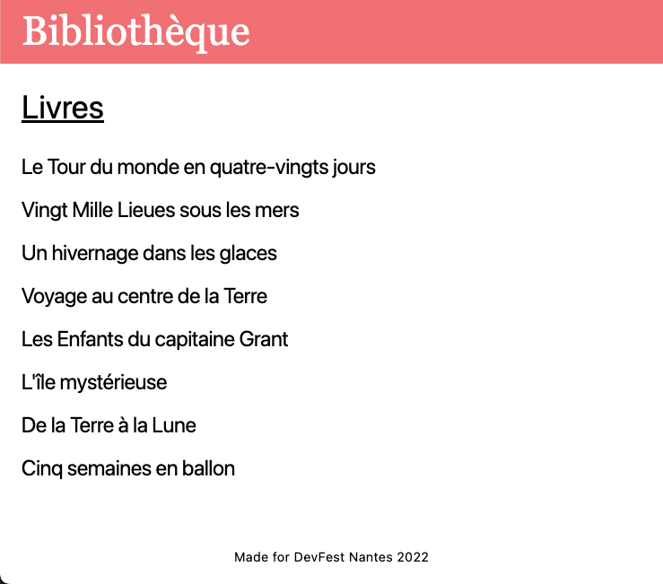

# Bookshelf

## Description

L'application `Bookshelf` liste les romans de Jules Verne et fournit une vue détaillée de chaque roman.  
Le projet est organisé en [monorepo](https://monorepo.tools/). Il utilise [pnpm](https://pnpm.io/) et ses [workspaces](https://pnpm.io/workspaces) ainsi que [Turborepo](https://turborepo.org/).  
Le frontend est développé avec [React](https://reactjs.org/) et [Tailwind](https://tailwindcss.com/).  
Pour simplifier l'atelier, il n'y a pas de backend, toutes les données sont en dur.

## Structure

### Répertoires

- _apps_ : contient les applications buildables et déployables
- _configs_ : contient des packages de configuration (Webpack, ESLint, Prettier, Typescript)
- _doc_ : [Docusaurus](https://docusaurus.io/) pour cette documentation
- _example_ : Exemple d'utilisation de Module Federation
- _packages_ : contient du code partagé (composants, api)

### Code

- `apps/bookshelf/src/App.tsx` : Composant principal contenant notamment la configuration des routes pour accéder aux vues liste et détail
- `packages/booklist/src/Booklist.tsx` : Vue liste
- `packages/book/src/Book.tsx` : Vue détail d'un livre

import Commands from '../partials/\_commands.mdx';

<Commands />
