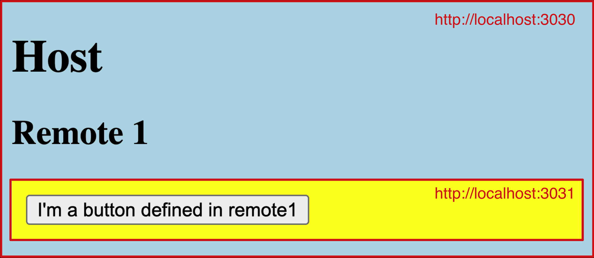
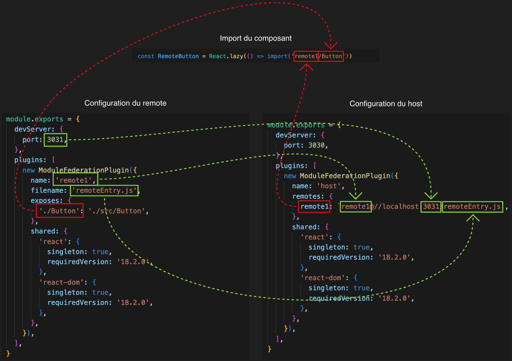

# Module Federation

## Micro Frontends


## Module Federation

https://webpack.js.org/concepts/module-federation/  
Principal développeur : https://twitter.com/ScriptedAlchemy  
TODO

## Exemple

Vous trouverez dans le répertoire `example` un exemple d'utilisation de Module Federation.  
Vous pouvez le lancer et aller sur l'url [localhost:3030](http://localhost:3030).

```bash
cd example
pnpm i
pnpm dev
```



### Configuration d'un remote

```js title="example/remote1/webpack.config.js"
const {ModuleFederationPlugin} = require('webpack').container

module.exports = {
  devServer: {
    port: 3031, // port de dev
  },
  plugins: [
    new ModuleFederationPlugin({
      // Nom du module, il doit être unique.
      name: 'remote1',
      // Nom du fichier contenant les informations du module. C'est le fichier qui sera téléchargé par le host et qui permettra de gérer les dépendances partagées et le chargement du module.
      filename: 'remoteEntry.js',
      // La liste des exports partagés (il peut s'agir de n'importe quel code JS)
      exposes: {
        // <Chemin utilisé lors de l'import>: <Chemin vers le fichier qu'on souhaite exporter>
        './Button': './src/Button',
      },
      // Librairies partagées
      shared: {
        'react': {
          singleton: true,
          requiredVersion: '18.2.0',
        },
        'react-dom': {
          singleton: true,
          requiredVersion: '18.2.0',
        },
      },
    }),
  ],
}
```

### Configuration d'un host

```js title="example/host/webpack.config.js"
const {ModuleFederationPlugin} = require('webpack').container

module.exports = {
  // ...,
  devServer: {
    port: 3030,
  },
  plugins: [
    new ModuleFederationPlugin({
      // Nom du module, il doit être unique.
      name: 'host',
      // La liste des modules remote importés
      remotes: {
        // <Nom utilisé lors de l'import>: <Nom du remote définit dans sa configuration>@<Url vers le fichier décrivant le remote>
        remote1: `remote1@//localhost:3031/remoteEntry.js`,
      },
      // Librairies partagées
      shared: {
        'react': {
          singleton: true,
          requiredVersion: '18.2.0',
        },
        'react-dom': {
          singleton: true,
          requiredVersion: '18.2.0',
        },
      },
    }),
  ],
}
```

### Signification des paramètres


