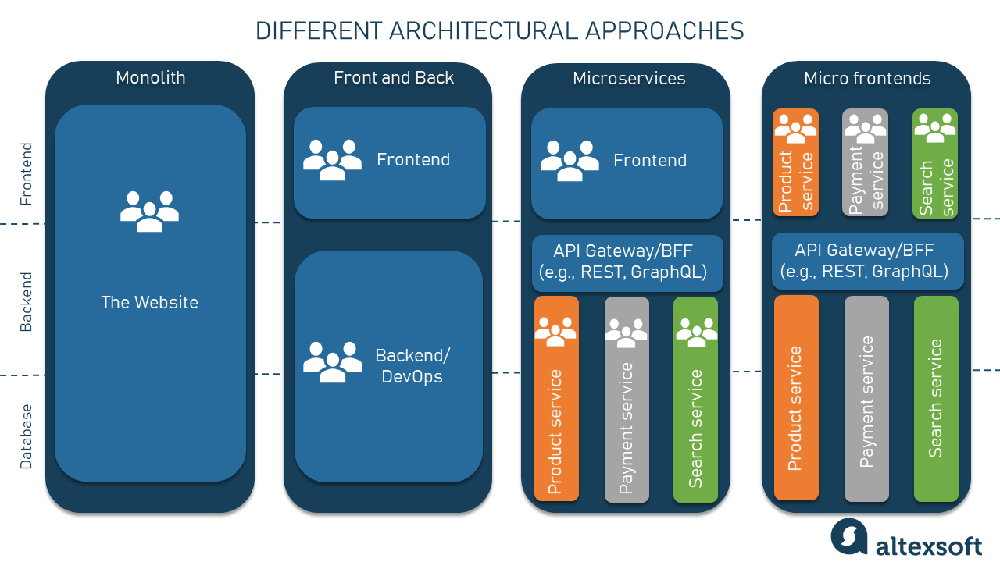

# Module Federation

## Micro Frontends



## Module Federation

Crée par [Zack Jackson](https://twitter.com/ScriptedAlchemy) et sorti avec [Webpack 5](https://webpack.js.org/blog/2020-10-10-webpack-5-release/#module-federation), [Module Federation](https://webpack.js.org/concepts/module-federation) est une solution permettant de charger et de partager des modules Javascript buildés indépendamment.

Nous parlerons souvent de `host` et de `remote` modules :

- un `remote` est un module Javascript qui sera chargé dynamiquement par notre application.  
  Il est buildé indépendamment de l'application qui le charge.
  Il peut exposer des composants, des fonctions, etc.. n'importe quel élément `export`able.
- un `host` est notre application principale, celle qui va charger les `remote` modules.

Nous verrons également la notion de `shared`.  
Ce sont des packages que le `host` et les `remotes` peuvent déclarer pour éviter de les inclure dans chaque module et de les charger plusieurs fois.

## Exemple

Vous trouverez dans le répertoire `example` un exemple d'utilisation de Module Federation.  
Vous pouvez le lancer et aller sur l'url [localhost:3030](http://localhost:3030).

```bash
(cd example && pnpm i)
(cd example && pnpm dev)
```

Dans cet exemple, nous avons notre `host` en fond bleu qui est chargé depuis localhost:3030.  
Il charge un `remote` module depuis localhost:3031 et affiche son composant exposé (fond jaune).  
Les librairies `react` et `react-dom` sont des `shared`.


### Configuration d'un remote

```js title="example/remote1/webpack.config.js"
const {ModuleFederationPlugin} = require('webpack').container

module.exports = {
  devServer: {
    port: 3031, // port de dev
  },
  plugins: [
    new ModuleFederationPlugin({
      // Nom du module, il doit être unique.
      name: 'remote1',
      // Nom du fichier contenant les informations du module. C'est le fichier qui sera téléchargé par le host et qui permettra de gérer les dépendances partagées et le chargement du module.
      filename: 'remoteEntry.js',
      // La liste des exports partagés (il peut s'agir de n'importe quel code JS)
      exposes: {
        // <Chemin utilisé lors de l'import>: <Chemin vers le fichier qu'on souhaite exporter>
        './Button': './src/Button',
      },
      // Librairies partagées
      shared: {
        'react': {
          singleton: true,
          requiredVersion: '18.2.0',
        },
        'react-dom': {
          singleton: true,
          requiredVersion: '18.2.0',
        },
      },
    }),
  ],
}
```

### Configuration d'un host

```js title="example/host/webpack.config.js"
const {ModuleFederationPlugin} = require('webpack').container

module.exports = {
  // ...,
  devServer: {
    port: 3030,
  },
  plugins: [
    new ModuleFederationPlugin({
      // Nom du module, il doit être unique.
      name: 'host',
      // La liste des modules remote importés
      remotes: {
        // <Nom utilisé lors de l'import>: <Nom du remote définit dans sa configuration>@<Url vers le fichier décrivant le remote>
        remote1: `remote1@//localhost:3031/remoteEntry.js`,
      },
      // Librairies partagées
      shared: {
        'react': {
          singleton: true,
          requiredVersion: '18.2.0',
        },
        'react-dom': {
          singleton: true,
          requiredVersion: '18.2.0',
        },
      },
    }),
  ],
}
```

### Signification des paramètres


